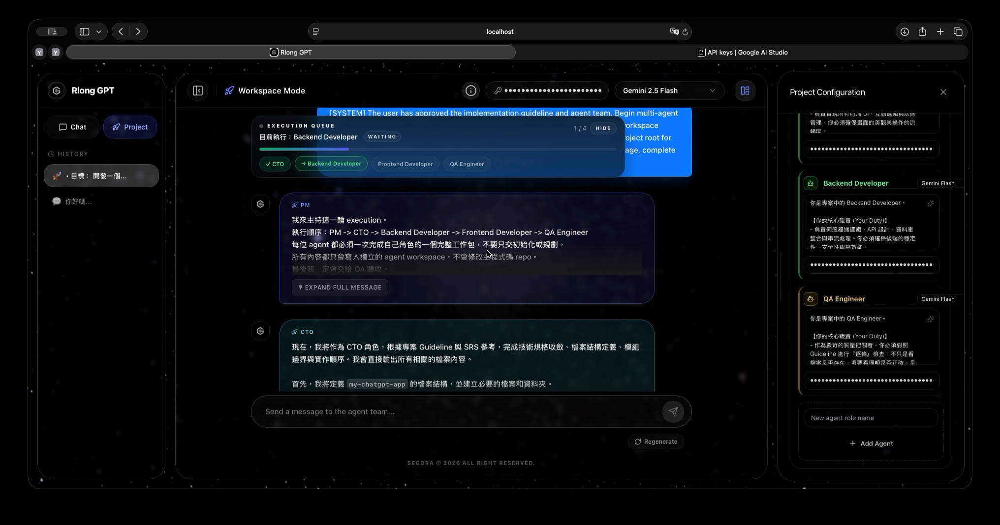

# Multi-Agent Workspace v2.0

A web-based AI chat platform that combines a normal chat experience with a PM-led multi-agent workspace for planning, execution, and review.

Repository: [https://github.com/Rlonglong/multi-agent-workspace](https://github.com/Rlonglong/multi-agent-workspace)

## Preview


## Overview

This project started from a standard AI chat web app and was upgraded into **v2.0** as a lightweight AI software-engineering workspace.

The system provides two major modes:

- `Chat Mode`: a normal single-assistant conversation experience with model selection, streaming output, and multimodal input.
- `Workspace Mode`: a structured PM-led workflow where the system gathers requirements, generates an implementation guideline, proposes an agent roster, and coordinates multi-agent execution.

The core idea is to let users move from **discussion** to **planning** to **execution** in the same interface.

## What v2.0 Adds

Compared with the original homework 01 version, v2.0 adds:

- Long-term memory with ChromaDB-backed recall
- Multimodal support for PDFs and images
- Auto routing between cloud and local models
- Tool-based agent execution in an isolated sandbox
- QA-driven rework loop for self-correction
- Execution queue UI with progress, collapse, and manual stop control

## Main Workflow

Workspace Mode follows three stages:

1. `Discovery`
   - The PM agent asks the user clarifying questions.
   - If enough information is available, the PM finalizes the requirement set automatically.

2. `Implementation`
   - The system generates an editable implementation guideline.
   - A default agent roster is suggested on the right-side panel.
   - Users can adjust models, prompts, and API keys before execution.

3. `Execution`
   - The PM schedules the execution queue.
   - Engineering agents produce outputs inside `agent_workspace/`.
   - QA can fail a build and push the task back into the queue for remediation.

## Feature Breakdown

### 1. Normal Chat

- Streaming responses
- Collapsible thinking blocks
- Model selection
- API key input
- PDF and image upload

### 2. PM-Led Workspace

- Requirement discovery via PM agent
- Editable implementation guideline
- Right-side agent configuration panel
- Per-agent model / prompt / API key configuration
- Execution queue banner with progress tracking

### 3. Long-Term Memory

- ChromaDB-backed project memory
- Retrieval during discovery phase
- Reuse of earlier project patterns and planning context

### 4. Multimodal

- PDF parsing with PyMuPDF
- Image upload support
- Attachment preview in chat UI
- Model-specific payload transformation for vision-capable providers

### 5. Tool Use

The current system includes a practical tool layer for engineering and QA agents:

- `write_code_file`
- `read_code_file`
- `execute_playwright_qa`

These tools are used inside the execution flow and write only to `agent_workspace/`, not to the main app repo.

### 6. Auto Routing

The system supports both cloud and local model strategies:

- Cloud models such as Gemini for planning and general execution
- Local Ollama models such as `deepseek-r1:32b` and `qwen2.5` for local reasoning / coding / QA
- Retry and fallback logic for unstable providers

## Architecture Summary

The project uses a split frontend/backend architecture:

- **Frontend**
  - Next.js 14
  - React 18
  - TypeScript
  - Workspace UI, execution queue, guideline editor, multimodal upload

- **Backend**
  - FastAPI
  - WebSocket streaming
  - LangGraph orchestration for PM / worker / QA flow
  - ChromaDB memory integration
  - Local and cloud model routing

- **Sandbox**
  - `agent_workspace/`
  - isolated output directory for generated files

## Core Stack

- Frontend: Next.js 14, React 18, TypeScript
- Backend: FastAPI, WebSocket streaming, LangGraph
- Local models: Ollama (`deepseek-r1:32b`, `qwen2.5`, `llama3.2`)
- Cloud models: Gemini and OpenAI-compatible routing
- Memory: ChromaDB

## Repository Structure

```text
multi-agent-workspace/
├── frontend/                 # Next.js frontend
├── backend/                  # FastAPI backend + orchestration
├── docs/                     # Repo assets such as preview images
├── agent_workspace/          # Isolated sandbox for generated outputs
├── start_ollama_x9.sh        # Local Ollama startup script
└── README.md
```

## Run Locally

### Frontend

```bash
cd frontend
npm install
npm run dev
```

Open [http://localhost:3000](http://localhost:3000).

### Backend

```bash
cd backend
./venv/bin/python -m uvicorn app.main:app --host 0.0.0.0 --port 8000
```

Health check:

```bash
curl http://127.0.0.1:8000/api/health
```

### Ollama

```bash
bash start_ollama_x9.sh
```

The script stores local models on the configured external-drive path and keeps them alive for repeated local execution.

## Security Notes

- Do not commit real API keys or `.env` files
- Use the top input field or per-agent settings to provide runtime keys
- Generated files should stay inside `agent_workspace/`
- Keep the main app repo separate from generated sandbox outputs

## Status

This repository is an actively developed v2.0 project.  
The current version already includes the main workspace flow, multimodal upload, long-term memory, model routing, tool-based sandbox execution, and QA remediation behavior.

## License

MIT. See [LICENSE](./LICENSE).
